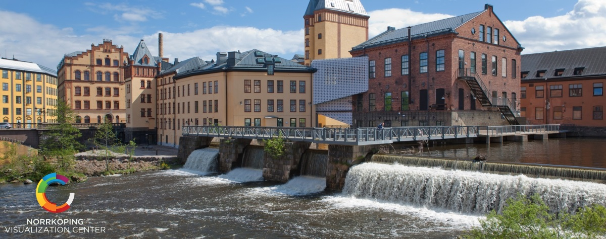
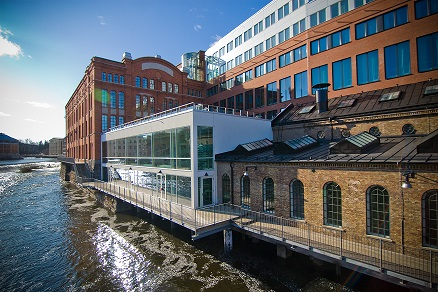

# IEEE Vis 2021 Sweden Satellite
The visualization team at [Linköping University](https://liu.se) is excited to host a satellite event for [IEEE Vis](https://ieeevis.org) 2021 in beautiful Norrköping, Sweden, and we'd love for you to join us between October 24th and 29th, 2021!  We are starting to plan for the event, while also carefully monitoring the COVID-19 situation in Sweden and across Europe.  If you are potentially interested in joining us in Norrköping for the event please fill out the information below.  We will contact you as plans take shape as well as to communicate any changes due to the pandemic. 

## Program
For the entire week, we will provide facilities to watch the live streams provided by the Vis conference.  Due to the time difference, these will predominantly take place in the afternoons local time.  An auxiliary program has been created for the morning sessions which will consist of a combination of demo sessions, seminar series, and lightning talks.  Additionally, there will be a local social event in the [Visualization Center C](http://visualiseringscenter.se/en), sponsored by [Visual Sweden](https://www.visualsweden.se/en/) with a dinner and an evening at the dome theater.

As soon as the program is finalized, we will update this page with more information.

## Logistics
The satellite event will take place at the Norrköping Campus of Linköping University.  Norrköping is a city located about 2h south of Stockholm and very easy to reach by car, train, and plane.

There are a number of greats hotels that are available during the conference time:
 - [The Lamp Hotel](https://www.thelamphotel.se/en/)
 - [Elite Grand Hotel](https://www.elite.se/en/hotels/norrkoping/grand-hotel/)
 - [President Hotel](https://president-hotel-norrkoping.hotel-ds.com/en/)
 - [Scandic Strömmen](https://www.scandichotels.com/hotels/sweden/norrkoping/scandic-strommen)

## Registration
In order for us to be able to host the event in a Corona-safe way, we will need to know how many visitors will will be expecting.  If you intend on joining us please complete [this survey](https://forms.office.com/Pages/ResponsePage.aspx?id=7Bg_kSZ_X0yoFnhP6aWO3UsUEfvoYE1AprAtgryeaaZURU8yODhPS0ZDMVM0RVVFUlFOU1lRNjVCUy4u) to receive updates via our mailing list and to enable the planning.  Due to the Corona-restrictions currently active in Sweden, there is a maximum number of participants that we can allow using our available facilities, so this registration is first-come, first-serve.  If you filled out the registration but then later reconsider, please let us know so that we can offer this space to another person.

The IEEE Vis [conference registration](http://ieeevis.org/year/2021/info/registration/conference-registration) is handled separately by the main event.

# Local Organizers
[Alexander Bock](https://scivis.github.io/staff/alebo68/) \
[Ingrid Hotz](https://scivis.github.io/staff/ingho32/) \
[Andreas Kerren](https://liu.se/en/employee/andke01) \
[Miriah Meyer](https://miriah.github.io/) \
[Anders Ynnerman](https://liu.se/en/employee/andyn27)
